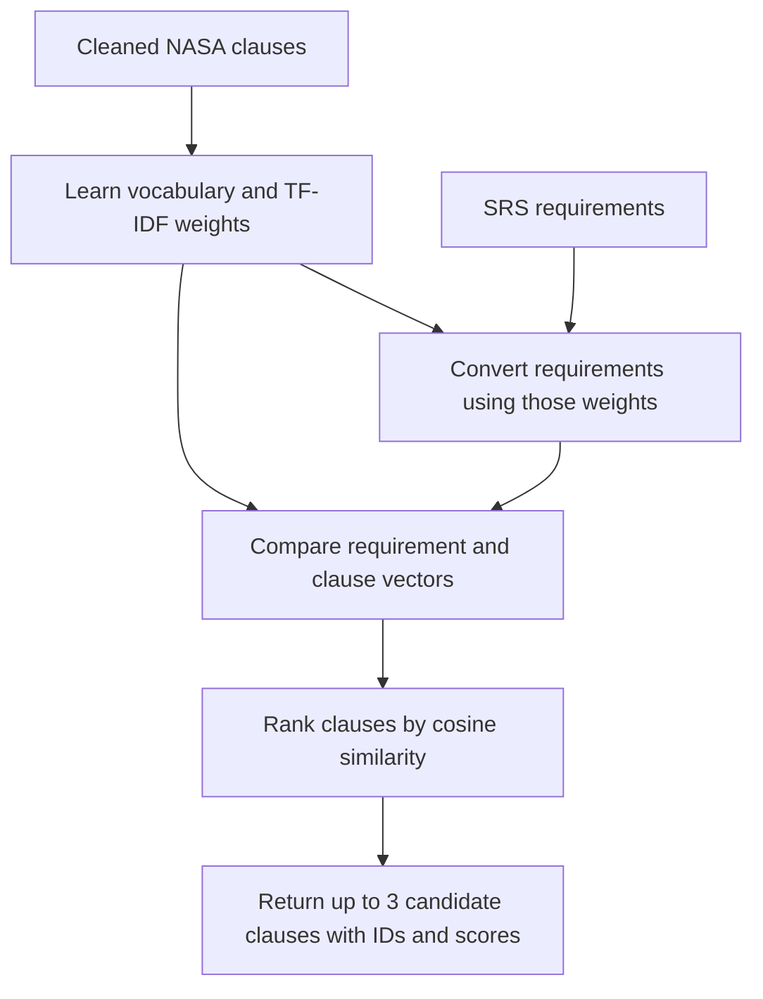

# Non-LLM baseline

The baseline retrieves NPR 7150.2D clauses using TF-IDF and applies explicit rules
to selected SRS evidence provisions. It uses no LLM or API key. The original
notebook retains the team's September preparation work; the short
`notebooks/Baseline_Model.ipynb` calls reusable code in `src/compliance_copilot/`.

## TF-IDF workflow



Each clause is a document. IDF gives distinctive words more weight than shared
words. Vocabulary and IDF are fitted only on the 14 SRS-addressable NASA clause
texts. Requirement titles and text are transformed using the same weights.
English stop words, boilerplate such as `shall` and `software`, SWE tags, and
numeric references are excluded from matching.

Up to `top_k=3` positive-score matches are returned in descending order. Ties use
numeric clause order. Zero-score clauses are not returned as matches.
`NO_LEXICAL_MATCH` preserves requirements without shared indexed words. There is
no tuned relevance threshold. Scores are neither probabilities nor verdicts.

## Run

From the repository root in a Python environment:

```sh
python -m pip install -r requirements-dev.txt
python scripts/prepare_data.py
python scripts/run_baseline.py
python -m pytest -q
```

Prepared inputs are committed, so preparation is needed only to reproduce them
or after source changes. It reads the bundled PDF offline, adapts the team's
extraction/repair code, validates body/Appendix C agreement, and exports:

- `data/processed/nasa_clauses.json`: 100 clauses with nested metadata.
- `data/processed/annotated_nasa_clauses.csv`: the full annotated corpus.
- `data/processed/srs_addressable_clauses.csv`: 14 candidate clauses.
- `data/processed/srs_requirements.csv`: 54 parsed requirements.
- `data/processed/manifest.json`: source hashes, counts, extraction QA and versions.

`data/srs_scope.json` contains the team's applicability mapping migrated from the
notebook. Its `direct`/`partial` values describe what an SRS can address, not
compliance verdicts. Extraction page ranges target the bundled NPR 7150.2D edition;
this is not a general parser for other standards.

Install Jupyter separately if needed to open `notebooks/Baseline_Model.ipynb`.
In Colab, clone this branch, install `requirements.txt`, and run from inside the
cloned repository. The notebook finds the root in the current directory or parents.

## Evidence rules and verdict scope

Results cite real SWE IDs, clause IDs and source text. Verdicts describe the named
`assessed_provision` under `assessment_scope=srs_evidence`, not complete NASA
compliance, actual software implementation, or external engineering records.

| Verdict | Meaning |
| --- | --- |
| `Meets` | The implemented provision check finds all required evidence signals. |
| `Partial` | Some relevant evidence exists; remaining obligations are unverified. |
| `Gap` | Required evidence is absent in the text searched by the provision check. |
| `REVIEW` | Applicability, wording or evidence is insufficient for a decision. |

| SWE ID | Document check | Pair behavior |
| --- | --- | --- |
| SWE-034 | Explicit acceptance-criteria wording; absent gives gap, present needs review. | Review. |
| SWE-050 | Recorded IDs; approval and maintenance remain unverified. | Review. |
| SWE-052 | Explicit table links from requirement IDs to parent mission needs. | Review. |
| SWE-053 | Requirements change-history wording; version metadata alone is insufficient. | Review. |
| SWE-157 | Authentication/unauthorized-access controls; NASA-STD-1006 conformance unverified. | Matching mandatory controls give partial evidence; negation needs review. |
| SWE-184 | Safety-control wording; other constraints, mitigations and assumptions unverified. | Matching mandatory controls give partial evidence. |
| SWE-210 | Collection, reporting and storage of adversarial-detection data. | Assess requirements containing adversarial-detection wording; unrelated text needs review. |

Other clauses return `REVIEW`. Document checks run independently of retrieval so
missing evidence cannot disappear through a retrieval miss. `DOCUMENT` is their
reserved requirement ID. SWE-052 does not treat an unlinked list of mission needs
as traceability. Even complete parent-link coverage does not verify all
bidirectional traceability. Wording checks are conservative heuristics and may
miss paraphrases or misinterpret context; review and benchmark validation are needed.

The 18 original ambiguity rules remain separate in `keyword_findings`.
`NO_RULE_MATCH` does not establish compliance; ambiguity does not automatically
establish a clause violation.

## Outputs and current observations

Each run writes CSV and JSON to `output/baseline/` for `keyword_findings`,
`clause_matches`, `pair_assessments` and `document_assessments`, plus `metrics.json`.
JSON retains evidence lists; CSV encodes them as JSON cells. Outputs are ignored
by Git and can be rebuilt. Use `--output` to select another directory.

On the bundled Starhawk corpus with `top_k=3`:

- 54 requirements and 14 clauses produce 63 positive candidate pairs.
- 17 requirements have no lexical match.
- Original keyword checks flag 17 requirements; 37 have no rule match.
- Candidate assessments yield 62 reviews and 1 partial-evidence result.
- Document checks yield 4 gaps, 3 partial-evidence results and 7 reviews.

These are pipeline observations, not accuracy measurements. NASA clause wording
is often abstract, so matching misses related SRS terms. For example,
`authenticate` and `authentication` are separate tokens; synonyms and stems are
not handled. Ranking and evidence coverage need benchmark-guided improvement.
`citation_id_validity` checks corpus IDs, not semantic groundedness.

## Benchmark evaluation

The advisor's benchmark and Data Card are absent. Ordinary runs record
`evaluation_status=awaiting_advisor_benchmark`, without invented performance.
Hand-authored test fixtures validate behavior; they are not ground truth.

| CSV column | Allowed values |
| --- | --- |
| `requirement_id` | Existing `SFMC-REQ-xxx` ID, or `DOCUMENT`. |
| `swe_id` | Existing SRS-addressable SWE ID. |
| `verdict` | `Meets`, `Partial`, or `Gap`. |
| `assessment_scope` | `srs_evidence`, corresponding to the named provisions above. |
| `split` (optional) | A partition name such as `tune` or `test`. |

Confirm compatibility with the advisor's Data Card before declaring this scope.
Whole-clause/process labels cannot be compared to these limited checks without
an advisor-reviewed scope mapping. The loader rejects mismatched scope declarations,
unknown IDs, invalid labels and duplicate pairs. Multiple partitions require an
explicit selection. Do not tune retrieval settings on test rows.

```sh
python scripts/run_baseline.py --benchmark data/benchmark.csv --split test
```

Omit `--split test` if there is no split column. Classification assesses gold pairs
directly, independently of retrieved candidates. Metrics include per-class
precision, recall, F1 and support; gap precision/recall with `Gap` positive and
`Partial` separate; overall accuracy; decision coverage; and a confusion matrix
including `REVIEW`. Reviewed gaps count as missed gaps, not excluded rows.

Retrieval reports recall of benchmarked pairs at k and per-requirement hit rate.
It does not infer precision from unlabeled candidate clauses. Undefined
precision/recall is zero alongside support counts. Benchmark predictions are
exported separately. Issue #2's measured-performance tasks remain dependent on #4.
